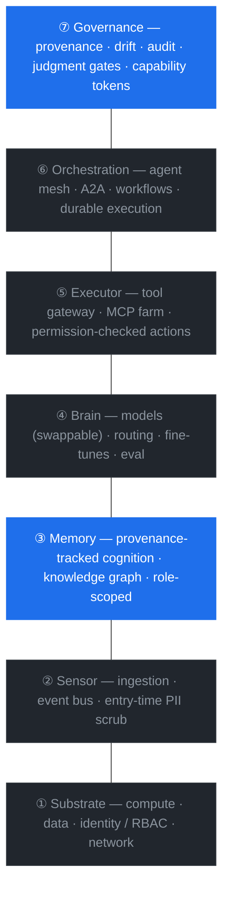

# The Enterprise AI OS: One Architecture, Three Scales

### Why the moat is memory and governance — not the model

> A reference architecture for company-wide AI, derived bottom-up from a working n=1 system rather than top-down from a vendor deck. Author: naze.

**English** · **[中文](README.zh-CN.md)**

---

**Every AI OS — one person's or a 100,000-person company's — is the same seven-layer stack. Five layers are commodity. Two decide who wins: memory and governance. And the whole mechanism is provable at n=1, for the price of a git repo and some discipline.**

## TL;DR

Every "AI OS" — whether it runs one person's life, a startup's operations, or a 100,000-person enterprise — is the same seven-layer stack. Five of those layers (compute, ingestion, models, action, orchestration) are **commodity**: everyone will have them, and they will converge. Two layers decide who wins:

- **③ Memory** — the organization's accumulated, proprietary, provenance-tracked cognition. The model is interchangeable precisely because continuity lives here.
- **⑦ Governance** — the kernel that lets autonomous agents act fast *without* silent drift, and makes that auditable. This is the real enterprise procurement gate.

The architecture is **scale-invariant**. What changes from n=1 to enterprise is actor count, scale, and compliance — not the kernel. Which means the cheapest place to get the kernel right is the smallest scale.

## The stack at a glance



The two blue layers — **③ Memory** and **⑦ Governance** — are the moat. The five grey layers are commodity: everyone gets them, and they converge.

## How to use this repo

This is not just the paper — it's an **adoption kit**. Everything below is copyable, and CI
runs the tools against the example environments on every push (green badge = what you're copying runs):

| You want to… | Go to |
|---|---|
| Adopt this at your company, starting from layer ① | [`adoption/playbook.md`](adoption/playbook.md) — four phases with exit criteria |
| Know where you stand today | [`adoption/maturity-model.md`](adoption/maturity-model.md) — score yourself per layer |
| Build a specific layer | [`layers/01-substrate/`](layers/01-substrate/) → [`07-governance/`](layers/07-governance/) — per-layer guide + copyable templates + acceptance checklist |
| See it as a running whole | [`examples/`](examples/) — two fictional but production-shaped environments: [BrightPath](examples/brightpath-learning/README.md) (45-person startup) and [Meridian](examples/meridian-freight/README.md) (12,000-person enterprise), same kernel, different scale |
| Verify it actually runs | `./checks.sh` — zero-dependency validators (risk gate, provenance audit, PII scrub) over the example environments; same thing CI runs |

```bash
git clone https://github.com/hegu-1/enterprise-ai-os-architecture && cd enterprise-ai-os-architecture
./checks.sh   # python3 stdlib only — no installs
```

Start at [`adoption/playbook.md`](adoption/playbook.md), Phase 0: the kernel files (RBAC matrix,
risk-tier policy, provenance validation in CI) come *before* any agent does.

## Receipts

Derived from a working system, not a slide. The mechanism has been run, not just argued:

- **n=1, in production** — a human ↔ multi-AI workflow handling ~100 signals/day end-to-end, stable for 12+ months, >95% dedup, zero high-risk mis-sends. The architecture below is what that system *is*, generalized upward.
- **The governance kernel, as shipped specs** — the six primitives in §4 aren't slideware; each is a published, standalone piece: [provenance-enforced-agent](https://github.com/hegu-1/provenance-enforced-agent) · [drift-aware-agent](https://github.com/hegu-1/drift-aware-agent) · [judgment-aware-agent](https://github.com/hegu-1/judgment-aware-agent) · [schema-coexistence-spec](https://github.com/hegu-1/schema-coexistence-spec) · [calibration-loop-protocol](https://github.com/hegu-1/calibration-loop-protocol) · [personal-ai-os-kernel](https://github.com/hegu-1/personal-ai-os-kernel).
- **The n=1 structure, cloneable today** — [personal-memory-vault-starter](https://github.com/hegu-1/personal-memory-vault-starter): the smallest scale, runnable now.

---

## 1. The reframe

Most "enterprise AI" conversations are stuck at the model layer: which LLM, how big, how cheap. That's the part that will commoditize fastest. The interesting structure is everything *around* the model.

An AI OS is not a product. It's a **layered stack**, and the same stack recurs at every scale because the underlying problem is the same: take messy input from the world, decide, act, and **remember in a way that compounds** — without losing the human in the loop.

Once you see it as a stack, two things follow: (a) you can reason about where the durable value is, and (b) you stop confusing "we have a model" with "we have an AI OS."

## 2. The seven layers

Bottom to top. For each: what it is, what's in it, the agents that live there, and how it fails.

**① Substrate.** Compute (GPU pools + inference scheduling), data lake/lakehouse, organizational identity (SSO/RBAC/SCIM), network isolation, secrets. No agents — pure infrastructure. *Fails when:* identity is the root of permission, so if it's wrong everything downstream is wrong; and when the data lake silts into a swamp. *You buy this.*

**② Sensor.** Ingestion from every channel and system — chat, email, tickets, meetings, docs, code, CRM, ERP, logs — onto a unified event bus with a schema registry. Agents: per-system connectors, a normalizer, dedup, and a **PII scrubber at the entry point** (entry-time redaction is the precondition for the memory layer's permissions). *Fails when:* source schemas drift silently, events duplicate or drop, or unscrubbed PII enters and poisons everything downstream. *You integrate this.*

**③ Memory ★ — first moat.** Not a database — a living cognition substrate that every agent reads and writes, that consolidates and forgets, that carries provenance and confidence. It's layered like memory itself:

```
L4 telos       org objectives, the "why"          (human-authored)
L3 semantic+procedural   concepts, SOPs, policies, the knowledge graph
L2 working knowledge     projects, docs, settled conclusions
L1 episodic    decisions, incidents, interactions  (org-scale "tracelets")
L0 raw         all ingestion, immutable, provenance-stamped
```

Physically: a temporal **knowledge graph** (entities/relations with validity windows) + a **vector store** + a **document store**, queried as one hybrid. The hard, valuable part enterprises need that smaller systems don't: **permission travels with memory** — the same underlying graph projects differently per role and per business unit, and retrieval filters by permission *before* it returns, not after. A leak here isn't a bug, it's a data breach.

Recall mimics human memory: association along graph edges (cross-BU edges are how you break information silos), lazy retrieval of only the activated-and-permitted sub-graph, salience/recency weighting, and continuous background **consolidation** (raw → episodic → semantic, dedup, merge, expire) balanced against compliance-driven retention and forgetting.

Why it's a moat: it compounds (time can't be compressed), it's proprietary (nobody else has your org's cognition), and it's trusted (provenance + audit). The model is swappable *because* this layer holds continuity.

**④ Brain.** The model capability layer plus how you choose and use models: foundation models (in-house + external, hot-swappable), a router that picks by task/cost/sensitivity/latency, domain fine-tunes/adapters, a rule layer (don't send trivial work to a large model), and inference caching. Agents: model-router, domain-experts, rule-engine, eval-harness. *Fails when:* everything routes to the biggest model (slow and expensive), fine-tunes overfit or catastrophically forget, or sensitive data flows to an external model. The craft is in routing and adaptation — but the model itself is commodity. **The real differentiation isn't the model; it's the context Memory feeds it.**

**⑤ Executor.** Turning decisions into real-world actions: an API/tool gateway, an **MCP server farm** exposing the whole company's tools uniformly, RPA, approval flows, per-action permission checks (every action passes RBAC + governance), idempotency/retry/compensation. Agents: tool-gateway, action-executor, approval-router. *Fails when:* actions execute beyond authority (governance must gate *before* execution, never filter after), non-idempotent operations repeat (double charges), or tools fragment because there's no unified gateway. *You integrate this; MCP is the 2026 standard.*

**⑥ Orchestration.** Multi-agent coordination, cross-BU delegation (agent-to-agent via discoverable agent cards), workflow engines, scheduling, durable execution for long-running and crash-resilient processes, and sagas/compensation. Agents: orchestrator, cross-BU router, scheduler. *Fails when:* orchestration deadlocks or loops, responsibility drifts (work nobody's agent owns), long-running state is lost, or you over-orchestrate (splitting what one agent could do). Mature open-source exists; the craft is in routing the right work to the right agent.

**⑦ Governance ★ — second moat, and the procurement gate.** This is covered in depth below.

Across all of it, a **platform (PaaS) layer**: each business unit builds its own vertical agents on the shared substrate; role-scoped digests give each role its own view (executives see conclusions / anomalies / decisions); an information-loss router moves the right signal to the right person or agent.

## 3. The two moats

The five commodity layers will converge across vendors — everyone gets models, a collaboration surface, and a cloud. The gap opens in Memory and Governance.

Memory is the moat because **cognition accumulates and can't be copied**. Governance is the moat because **trustworthy autonomy is the thing nobody can ship safely yet** — and trust infrastructure compounds with audit history, aligns with regulation (first movers set the standard), and is entangled with Memory (provenance lives there). The two lock together.

## 4. The governance kernel

The hardest problem in an enterprise AI OS is not capability. It's that **self-evolving agents plus persistent memory drift** — toward stale judgment, silent capture (the org's "memory" quietly diverging from what humans actually decided), and unauditable mutations. The tension is speed versus control. The resolution is a kernel that keeps the speed and eliminates the *silent* part of drift through provenance.

Six primitives:

- **Provenance-enforced** — every mutation emits its origin (who/what/why/source). Non-negotiable; this *is* the audit trail, by construction.
- **Drift-aware** — agents are instrumented for execution-overrun, abstraction-drift, and premature-closure, and these are surfaced, not suppressed.
- **Judgment-aware** — persistent memory distinguishes *current judgment* from *stale opinion*; judgments expire.
- **Schema-coexistence (core/edge)** — stable judgment lives in a slow, human-ratified core; evolving capability lives in a fast, agent-driven edge; promotion from edge to core is provenance-mediated.
- **Calibration loop** — external feedback → tagged source → schema delta → **human ratifies** → audit trail. This is how the org learns without drifting.
- **Capability tokens** — boundary-crossing actions require scoped, expiring, logged tokens; humans hold the keys; no token means refuse-and-surface.

Enterprise adds: **risk-tiered judgment gates** (route by risk × reversibility × blast-radius — auto for low, human-ratify for medium, multi-party for high, so you don't over-gate and kill the speed benefit), **compliance mapping** (policies and regulations compiled into machine-checkable rules, with audit evidence generated automatically), observability and evaluation across thousands of agents, delegation chains (which agent acts on whose authority, revocably), and incident rollback (every action reversible or compensable).

The deep point: the kernel is **the missing layer between human judgment and self-evolving agents.** It's what lets an organization deploy autonomous agents *without* losing human accountability. Without it, no serious enterprise will turn the agents loose — which is why governance, not capability, is the real gate.

## 5. One architecture, three scales

The same stack appears at n=1 (an individual's memory vault), at startup scale (an operations OS), and at enterprise scale. What's invariant is the kernel; what varies is scale and compliance.

| Dimension | n=1 (personal) | startup (ops-OS) | enterprise |
|---|---|---|---|
| Sensor | hand-fed + session | multi-channel scan | full event platform |
| Brain | one render-head | model + rule layer | model layer + routing + tuning |
| Executor | hands + scripts | CLI + a coding agent | tool gateway + MCP farm |
| Memory ★ | markdown vault | archive + context | knowledge graph (role-scoped) |
| Actors | one person + AI render-heads | one builder + team | whole company + agent mesh |
| Permissions | implicit | role/team | org RBAC + compliance |
| Governance ⑦ | tokens + self-review | dry-run + human-in-loop | regulatory gate + audit platform |
| Anti-silent-capture | you author decisions | humans review | humans ratify + enforced provenance |

**Invariant (the kernel):** the four-layer skeleton; memory-as-container (continuity lives in memory, not the model); provenance on every write; human-authored decisions vs. agent-written connective tissue; phase alignment / information-loss reduction as the telos; and the fact that the moats are always Memory and Governance.

**Variant (only these):** script → platform → platform-of-platforms; one render-head → multi-AI → agent mesh; implicit permissions → RBAC → org RBAC + compliance; self-review → human-in-loop → regulatory forcing function; hundreds of nodes → millions.

Every variant is a *scale/compliance* dimension. Every invariant is a *kernel* dimension. Get the mechanism wrong and scale just makes it wrong faster; get it right and the rest is engineering and compliance.

## 6. Build sequence

The same phased rollout at any scale: (1) prove one vertical (or BU) end-to-end; (2) replicate to two or three to prove the substrate generalizes — the platform layer forms here; (3) let signals flow back and across verticals; (4) add the cross-cutting OS layer — shared memory graph, cross-BU router, role/exec digests, governance. Only at step 4 does it stop being N stacked automations and become an OS, because that's when information stops getting stuck between silos. **Provenance comes first within every step** — without it, everything above is built on sand.

## 7. What this means

If the model is commodity and the moats are Memory and Governance, then the rational path is not to chase the biggest model. It's to get the kernel — memory-as-container, provenance, judgment preservation, anti-silent-capture, calibration — right at the **cheapest, fastest-iterating scale**, and scale it up. n=1 is that scale. A single person running this architecture validates the mechanism for the price of a git repo and some discipline.

The enterprises have the scale and the compliance. What most don't yet have is a kernel they've thought through — they're still competing on the commodity layers. The architecture above is an attempt to name where the durable value actually sits.

## 8. What this is not

This is a **reference architecture derived from a working small-scale system**, not the internal architecture of any specific large company. The layer mapping to specific vendors is illustrative. The claim is not "I built enterprise AI OS"; it's that the *mechanism* of the two moats is scale-invariant and can be validated cheaply — and that capability, the thing everyone is racing on, is the part that commoditizes.

---

## Kernel & related

The kernel this architecture rests on (provenance / drift / judgment / anti-silent-capture / calibration) is laid out in an upstream position paper — the missing layer between human judgment and self-evolving agents. This repo is its **enterprise-scale extension**.

- [coevolution-kernel](https://github.com/hegu-1/coevolution-kernel) — the kernel thesis (human judgment ↔ self-evolving agents)
- [personal-memory-vault-starter](https://github.com/hegu-1/personal-memory-vault-starter) — the n=1-scale structure, cloneable
- [中文版](README.zh-CN.md) — Chinese version of this paper (chapter files in [`docs/`](docs/))

---

*By naze. Derived from a personal memory-vault system (n=1) and the open kernel work on provenance, drift, judgment, and calibration.*
